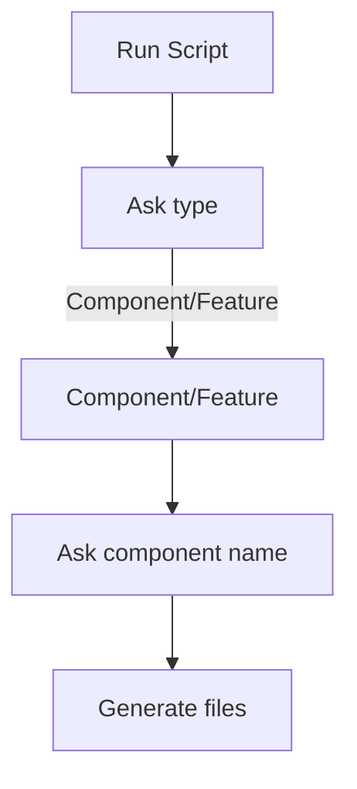

# generate-component-set

This script generates files which composed of React component.

## Requirement
- tsx
- inquire

### tsx

```sh
npm install -D typescript tsx
```

### inquire

```sh
npm i -D inquirer
```

## Usage

[Note]
To see the flowchart, you need to install VSCode Extension: [Markdown Preview Enhanced](https://shd101wyy.github.io/markdown-preview-enhanced/#/) and [Markdown Preview Mermaid Support](https://marketplace.visualstudio.com/items?itemName=bierner.markdown-mermaid)

To preview, type `[cmd]+k` and `v`.

## Flowchart


